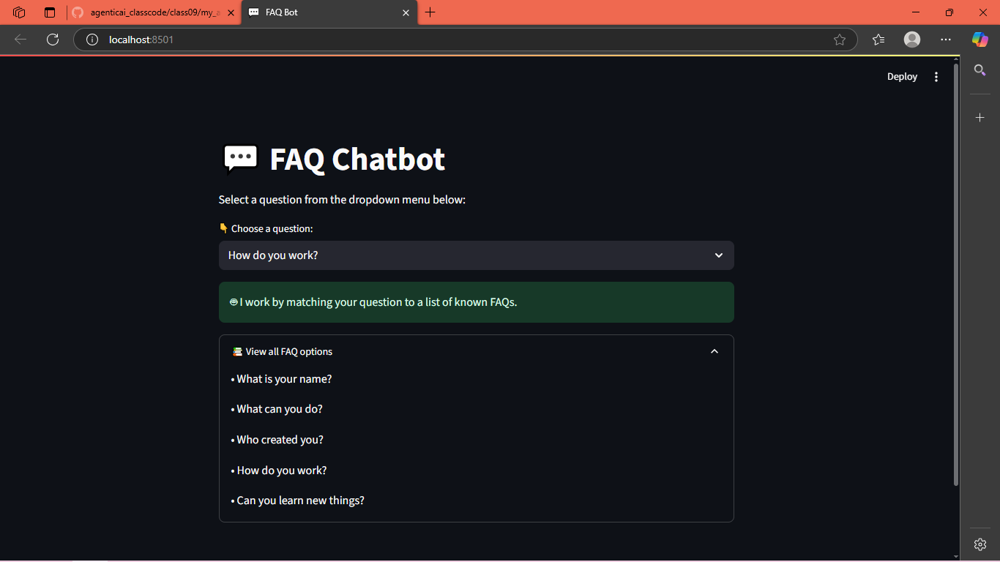

💬 FAQ Chatbot (Streamlit)

Ye project ek interactive FAQ chatbot hai jo predefined questions ke answers user ko browser me display karta hai. Streamlit ka use karke simple aur user-friendly interface banaya gaya hai.

🌍 Features

Predefined list of FAQs for quick answers.

Interactive dropdown menu to select questions.

Answers displayed instantly in the browser.

Expandable section to view all available FAQs.

Environment variable support for future API integrations.

🚀 How It Works

Global Level – Environment variables load hote hain (jaise API keys) aur shared configuration set hoti hai.

Bot Logic – Predefined questions aur answers ka database hai, jise user input ke saath match kiya jata hai.

Run Level – Streamlit UI me user question select karta hai aur answer instantly display hota hai.

Expandable FAQ Section – User ko poore question list ka overview milta hai.